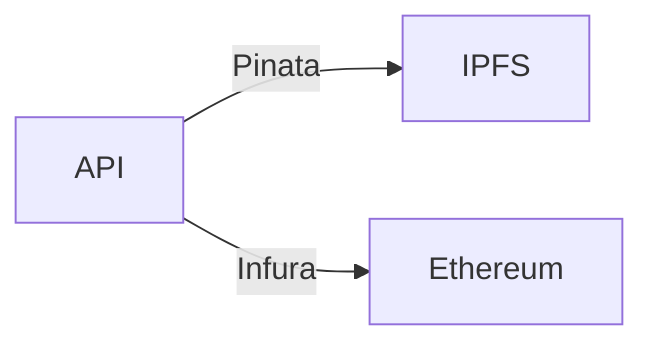

# About

**AutoNFT-X** is a straightforward tokenization solution designed to track vehicle ownership and status efficiently.<br>It features an Express.js API integrated with ethers.js and an ERC721-based NFT contract to create unique digital representations of vehicles.



## Features

Main API functionalities, described in [documentation]():

1. **Mint NFT**
   - **Receive form data and image via POST**
   - **Upload image to IPFS via Pinata**
   - **Upload metadata (vehicle data + image hash) to IPFS via Pinata**
   - **Mint a new vehicle NFT based on provided data**
2. **Transfer NFT**
3. **Get vehicle data by ID**
4. **Get vehicle history by ID**
5. **Get OpenSea URL by ID**

<br>

AutoNFT-X contract also inherits all functions of [ERC721](https://github.com/OpenZeppelin/openzeppelin-contracts/blob/master/contracts/token/ERC721/ERC721.sol), [ERC721URIStorage](https://github.com/OpenZeppelin/openzeppelin-contracts/blob/master/contracts/token/ERC721/extensions/ERC721URIStorage.sol), [ERC721Pausable](https://github.com/OpenZeppelin/openzeppelin-contracts/blob/master/contracts/token/ERC721/extensions/ERC721Pausable.sol), [Ownable](https://github.com/OpenZeppelin/openzeppelin-contracts/blob/master/contracts/access/Ownable.sol), and [ERC721Burnable](https://github.com/OpenZeppelin/openzeppelin-contracts/blob/master/contracts/token/ERC721/extensions/ERC721Burnable.sol). <br>API interaction availability according to access control and contract state. For more, please refer to the [OpenZeppelin documentation](https://docs.openzeppelin.com/contracts/4.x/).

## Resources

- **Ethereum Mainnet**
- **Solidity**
- **Foundry**
- **Pinata**
- **IPFS**
- **JavaScript**
- **Express.js**
- **Ethers.js**
- **Docker**<br>

## Configuration

### Contracts

1. Create './AutoNFT-X/.env' and paste/fill in:

   > CHAIN_ID=1<br>
   > MAINNET_NODE_RPC_URL=[infura-cloud-endpoint](https://docs.infura.io/api/network-endpoints)<br>
   > PRIVATE_KEY=[0x...b2](https://support.metamask.io/pt-br/managing-my-wallet/secret-recovery-phrase-and-private-keys/how-to-export-an-accounts-private-key/). PS: Add '0x' as the example<br>
   > ETHERSCAN_API_KEY=[owner-etherscan-api-key](https://docs.etherscan.io/getting-started/viewing-api-usage-statistics)<br>

### API

<br>

---

# Ethereum mainnet deployment

At './AutoNFT-X/':

```bash
curl -L https://foundry.paradigm.xyz | bash
foundryup
forge --version
forge build --via-ir
forge script script/AutoNFT.s.sol:AutoNFTScript --via-ir --rpc-url $MAINNET_NODE_RPC_URL --broadcast --verify
```

Two transaction hashes will be logged: contract deployment one and first AutoNFT minting one. Go to [etherscan](https://etherscan.io/) and query the hashes to confirm deployment success.
