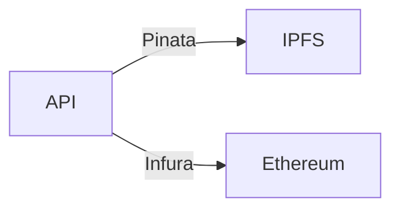

**This repository contains only the documentation for AutoNFT-X solution**, including component diagram and configuration requirements. <br>The actual codebase is not included in this repository **due to its proprietary nature as a commercial project.**

# About

**AutoNFT-X** is a straightforward tokenization solution designed to track vehicle ownership and status efficiently.<br>It features an Express.js API integrated with ethers.js and an ERC721-based NFT contract to create unique digital representations of vehicles.<br>Contract's owner is allowed for token operations execution by default.



## Features

Main API functionalities, described in localhost [documentation](https://localhost:3000/api-docs/#/):

1. **Mint NFT**
   - **Receive form data and image via POST**
   - **Upload image to IPFS via Pinata**
   - **Upload metadata (vehicle data + image hash) to IPFS via Pinata**
   - **Mint a new vehicle NFT based on provided data**
2. **Transfer NFT**
3. **Get vehicle data by ID**
4. **Get vehicle ownership history by ID**
5. **Get OpenSea URL by ID**

<br>

AutoNFT-X contract also inherits all functions of [ERC721](https://github.com/OpenZeppelin/openzeppelin-contracts/blob/master/contracts/token/ERC721/ERC721.sol), [ERC721URIStorage](https://github.com/OpenZeppelin/openzeppelin-contracts/blob/master/contracts/token/ERC721/extensions/ERC721URIStorage.sol), [ERC721Pausable](https://github.com/OpenZeppelin/openzeppelin-contracts/blob/master/contracts/token/ERC721/extensions/ERC721Pausable.sol), [Ownable](https://github.com/OpenZeppelin/openzeppelin-contracts/blob/master/contracts/access/Ownable.sol), and [ERC721Burnable](https://github.com/OpenZeppelin/openzeppelin-contracts/blob/master/contracts/token/ERC721/extensions/ERC721Burnable.sol). <br>API interaction availability according to access control and contract state. For more, please refer to the [OpenZeppelin documentation](https://docs.openzeppelin.com/contracts/4.x/).

## Resources

- **Ethereum**
- **Solidity**
- **Foundry**
- **Pinata**
- **IPFS**
- **JavaScript**
- **Express.js**
- **Ethers.js**<br>

## Deployment

In all deployment cases, you'll need to deploy the contract before deploying the API.

- Fill in './AutoNFT-X/.env':

> //mainnet
> MAINNET_NODE_RPC_URL=[infura-cloud-endpoint](https://docs.infura.io/api/network-endpoints)<br>
> MAINNET_CHAIN_ID=1 [chain-id](https://docs.infura.io/infura/networks/sepolia)<br>
> MAINNET_ETHERSCAN_API_KEY=[owner-etherscan-api-key](https://docs.etherscan.io/getting-started/viewing-api-usage-statistics)<br>

> //sepolia
> SEPOLIA_NODE_RPC_URL=[infura-cloud-endpoint](https://docs.infura.io/api/network-endpoints)<br>
> SEPOLIA_CHAIN_ID=11155111 [chain-id](https://docs.infura.io/infura/networks/sepolia)<br>
> SEPOLIA_ETHERSCAN_API_KEY=[owner-etherscan-api-key](https://docs.etherscan.io/getting-started/viewing-api-usage-statistics)<br>

> //pinata
> PINATA_API_KEY=[pinata-api-key](https://knowledge.pinata.cloud/en/articles/6191471-how-to-create-an-pinata-api-key)<br>
> PINATA_API_SECRET=[pinata-api-secret](https://knowledge.pinata.cloud/en/articles/6191471-how-to-create-an-pinata-api-key)<br>

> //private key
> PRIVATE_KEY=[0x...b2] PS: Add '0x' as the example<br>

- Fill in './API/.env':

> //mainnet
> MAINNET_NODE_RPC_URL=[infura-cloud-endpoint](https://docs.infura.io/api/network-endpoints)<br>
> MAINNET_CHAIN_ID=1 [chain-id](https://docs.infura.io/infura/networks/sepolia)<br>

> //sepolia
> SEPOLIA_NODE_RPC_URL=[infura-cloud-endpoint](https://docs.infura.io/api/network-endpoints)<br>
> SEPOLIA_CHAIN_ID=11155111 [chain-id](https://docs.infura.io/infura/networks/sepolia)<br>

> //localhost
> LOCAL_PROVIDER=http://localhost:8545<br>
> LOCAL_CHAIN_ID=31337<br>

> //pinata
> PINATA_API_KEY=[pinata-api-key](https://knowledge.pinata.cloud/en/articles/6191471-how-to-create-an-pinata-api-key)<br>
> PINATA_API_SECRET=[pinata-api-secret](https://knowledge.pinata.cloud/en/articles/6191471-how-to-create-an-pinata-api-key)<br>

> //contract
> CONTRACT_OWNER_ADDRESS= Contract's owner/deployer address. Used as Signer by the API.<br>
> AUTONFT_CONTRACT_ADDRESS= Set manually after contract's deployment. Displayed in foundry depolyment logs.<br>
> CONTRACT_OWNER_PRIVATE_KEY=[0x...b2]<br> PS: Add '0x' as the example<br>

## Local deployment configuration

#### Contracts layer

- In './AutoNFT-X/' Run:

```bash
curl -L https://foundry.paradigm.xyz | bash
foundryup
forge --version
forge build --via-ir
   anvil [another terminal]
forge script script/AutoNFT.s.sol:AutoNFTScript --fork-url http://localhost:8545 --broadcast
```

#### API layer

- In './API/' Run:

```bash
node api.js
```

## Sepolia deployment configuration

#### Contracts layer

- In './AutoNFT-X/':

```bash
curl -L https://foundry.paradigm.xyz | bash
foundryup
forge --version
forge build --via-ir
forge script script/AutoNFT.s.sol:AutoNFTScript --via-ir --rpc-url $SEPOLIA_NODE_RPC_URL --broadcast --verify --etherscan-api-key $SEPOLIA_ETHERSCAN_API_KEY
```

#### API layer

- In './API/' Run:

```bash
node api.js
```

## Mainnet deployment configuration

#### Contracts layer

- In './AutoNFT-X/':

```bash
curl -L https://foundry.paradigm.xyz | bash
foundryup
forge --version
forge build --via-ir
forge script script/AutoNFT.s.sol:AutoNFTScript --via-ir --rpc-url $MAINNET_NODE_RPC_URL --broadcast --verify --etherscan-api-key $MAINNET_ETHERSCAN_API_KEY
```

#### API layer

- In './API/' Run:

```bash
node api.js
```
